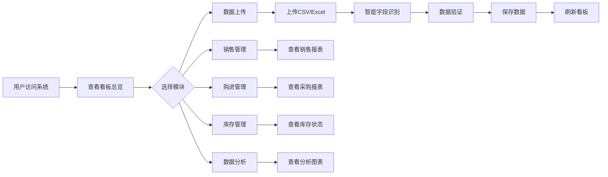

## 1. Product Overview

湖北盐业集团有限公司荆州分公司库存商品进销存智能管理看板系统，是一个基于浏览器运行的企业级数据可视化平台，旨在帮助市场营销中心实时掌握库存、销售、采购等核心业务数据，支持精细化经营决策。

## 2. Core Features

### 2.1 User Roles
| Role | Registration Method | Core Permissions |
|------|---------------------|------------------|
| 管理员 | 本地配置 | 完整系统管理权限，数据上传，系统配置 |
| 普通用户 | 本地配置 | 浏览看板、查看数据报表 |

### 2.2 Feature Module
1. **看板总览**: 核心KPI卡片、月度趋势图、分类占比饼图、TOP10销售、库存预警概览
2. **销售管理**: 分类销售柱状图、单价分析、销售明细表、分类筛选功能
3. **购进管理**: 采购量柱状图、购进结构饼图、购进明细表
4. **库存管理**: 仓库分布图、预警分布饼图、预警详情列表、库存搜索
5. **数据分析**: 进销存对比分析、库存趋势图、分类经营台账
6. **数据上传**: CSV/Excel文件上传、智能字段识别、手动录入
7. **系统设置**: 数据刷新、系统信息、部署同步

### 2.3 Page Details
| Page Name | Module Name | Feature description |
|-----------|-------------|---------------------|
| 看板总览 | KPI卡片 | 销售总额、购进量、库存量、预警数实时展示，带数值动画效果 |
| 看板总览 | 月度趋势图 | 近12个月进销存趋势折线图 |
| 看板总览 | 分类占比饼图 | 商品分类销售占比可视化 |
| 看板总览 | TOP10销售 | 销售额排名前10商品列表 |
| 看板总览 | 库存预警 | 库存不足商品预警提示 |
| 销售管理 | 分类销售柱状图 | 各分类销售额对比 |
| 销售管理 | 单价分析 | 商品单价区间分布 |
| 销售管理 | 销售明细表 | 完整销售数据列表，支持筛选 |
| 购进管理 | 采购量柱状图 | 各类别采购量对比 |
| 购进管理 | 购进结构饼图 | 采购来源/品类结构分析 |
| 购进管理 | 购进明细表 | 完整采购数据列表 |
| 库存管理 | 仓库分布图 | 各仓库库存量占比 |
| 库存管理 | 预警分布饼图 | 各仓库预警数量分布 |
| 库存管理 | 预警详情列表 | 预警商品详细信息 |
| 库存管理 | 库存搜索 | 按物料编码/名称搜索库存 |
| 数据分析 | 进销存对比 | 购进、销售、库存三维对比图 |
| 数据分析 | 库存趋势 | 库存变化趋势分析 |
| 数据分析 | 经营台账 | 分类经营数据汇总表 |
| 数据上传 | 文件上传 | CSV/Excel拖拽上传 |
| 数据上传 | 字段识别 | 智能匹配数据字段 |
| 数据上传 | 手动录入 | 表单手动录入数据 |

## 3. Core Process

## 4. User Interface Design

### 4.1 Design Style
- **主色调**: 深蓝色(#1e40af)作为主色，配合青色(#06b6d4)作为强调色，体现企业专业感
- **辅助色**: 绿色(#22c55e)用于成功状态，橙色(#f97316)用于警告状态，红色(#ef4444)用于错误状态
- **按钮样式**: 圆角矩形，带悬停阴影效果
- **字体**: 思源黑体(Source Han Sans SC)，清晰易读
- **布局**: 卡片式布局，顶部导航，左侧侧边栏
- **图标**: Lucide图标库，简洁现代风格

### 4.2 Page Design Overview
| Page Name | Module Name | UI Elements |
|-----------|-------------|-------------|
| 看板总览 | 整体布局 | 顶部标题栏+导航，主体4x2 KPI卡片网格，下方左右双栏图表布局 |
| 看板总览 | KPI卡片 | 圆角卡片，渐变背景，数值动画，图标+标签组合 |
| 看板总览 | 图表区域 | 响应式双栏布局，图表容器带阴影边框 |
| 销售/购进/库存管理 | 筛选栏 | 顶部水平筛选区域，下拉选择器+搜索框 |
| 销售/购进/库存管理 | 表格区域 | 固定表头，斑马纹行，可滚动内容区 |
| 数据上传 | 上传区域 | 大尺寸拖拽区域，虚线边框，上传图标 |

### 4.3 Responsiveness
- **桌面端**: 完整四栏布局，侧边栏固定
- **平板端**: 双栏布局，侧边栏折叠为图标
- **移动端**: 单栏布局，顶部导航转为汉堡菜单

### 4.4 Animation Effects
- 页面加载时KPI数值递增动画
- 图表入场渐现动画
- 卡片悬停缩放效果
- 导航切换过渡动画
- 数据刷新加载动画
