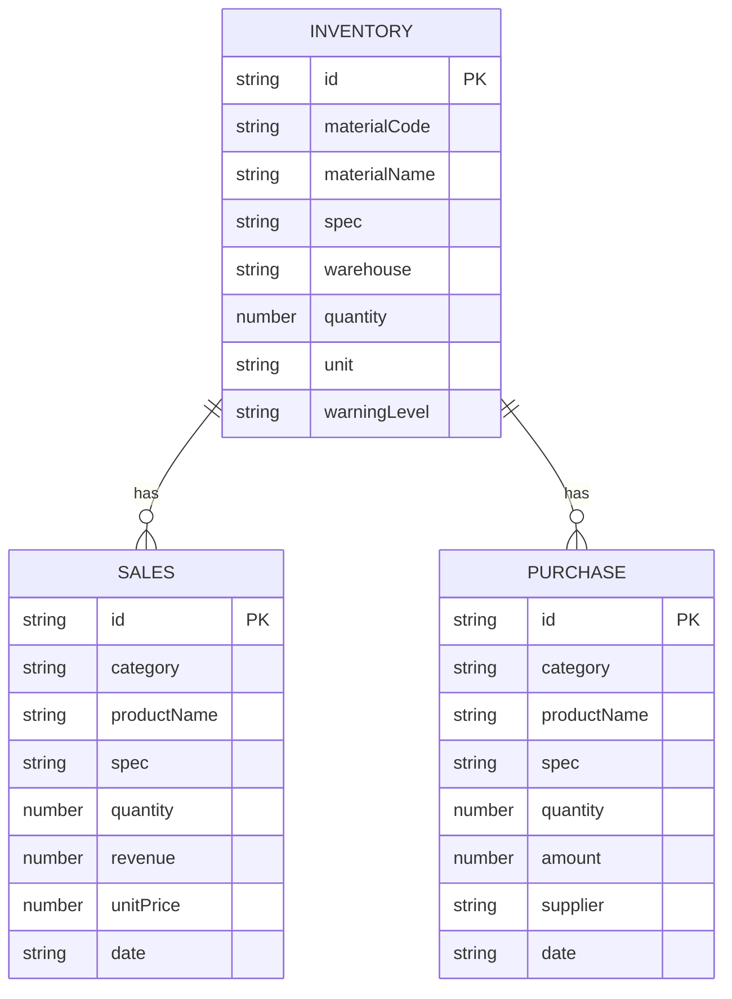

## 1. Architecture Design

```mermaid
flowchart TB
    subgraph Frontend
        A[React + TypeScript] --> B[Vite]
        B --> C[Tailwind CSS]
        C --> D[Chart.js]
        D --> E[Lucide React]
        E --> F[Zustand]
    end
    
    subgraph Data Layer
        G[Mock Data] --> H[Local Storage]
        H --> I[JSON Files]
    end
    
    Frontend --> Data Layer
```

## 2. Technology Description

- **Frontend**: React@18 + TypeScript + Tailwind CSS@3 + Vite@6
- **State Management**: Zustand
- **Charting**: Chart.js + react-chartjs-2
- **Icons**: Lucide React
- **Routing**: React Router DOM
- **Data**: Mock JSON data + Local Storage persistence
- **Build Tool**: Vite
- **Deployment**: GitHub Pages

## 3. Route Definitions

| Route | Purpose | Component |
|-------|---------|-----------|
| / | 看板总览 | Dashboard |
| /sales | 销售管理 | Sales |
| /purchase | 购进管理 | Purchase |
| /inventory | 库存管理 | Inventory |
| /analytics | 数据分析 | Analytics |
| /upload | 数据上传 | Upload |

## 4. API Definitions

由于是纯前端系统，数据通过本地Mock数据模拟API。

### 4.1 数据类型定义

```typescript
interface InventoryItem {
  id: string;
  materialCode: string;
  materialName: string;
  spec: string;
  warehouse: string;
  quantity: number;
  unit: string;
  warningLevel?: 'low' | 'medium' | 'high';
}

interface SalesItem {
  id: string;
  category: string;
  productName: string;
  spec: string;
  quantity: number;
  revenue: number;
  unitPrice: number;
  date: string;
}

interface PurchaseItem {
  id: string;
  category: string;
  productName: string;
  spec: string;
  quantity: number;
  amount: number;
  supplier?: string;
  date: string;
}

interface MonthlyStats {
  month: string;
  sales: number;
  purchase: number;
  inventory: number;
}

interface DashboardStats {
  totalSales: number;
  totalPurchase: number;
  totalInventory: number;
  warningCount: number;
  salesGrowth: number;
  purchaseGrowth: number;
}
```

### 4.2 Mock API函数

| 函数名 | 功能 | 返回数据 |
|--------|------|----------|
| getDashboardStats | 获取仪表盘统计 | DashboardStats |
| getInventoryList | 获取库存列表 | InventoryItem[] |
| getInventoryWarnings | 获取预警库存 | InventoryItem[] |
| getSalesSummary | 获取销售汇总 | SalesItem[] |
| getSalesDetail | 获取销售明细 | SalesItem[] |
| getPurchaseSummary | 获取购进汇总 | PurchaseItem[] |
| getPurchaseDetail | 获取购进明细 | PurchaseItem[] |
| getMonthlyTrend | 获取月度趋势 | MonthlyStats[] |
| getWarehouseDistribution | 获取仓库分布 | { warehouse: string, quantity: number }[] |
| getCategorySales | 获取分类销售 | { category: string, revenue: number }[] |

## 5. Project Structure

```
src/
├── components/          # 通用组件
│   ├── Layout/         # 布局组件
│   │   ├── Header.tsx
│   │   ├── Sidebar.tsx
│   │   └── index.tsx
│   ├── Dashboard/      # 仪表盘组件
│   │   ├── KPICard.tsx
│   │   ├── TrendChart.tsx
│   │   ├── PieChart.tsx
│   │   └── TopSalesList.tsx
│   ├── Charts/         # 图表组件
│   │   ├── BarChart.tsx
│   │   ├── LineChart.tsx
│   │   └── PieChart.tsx
│   ├── Table/          # 表格组件
│   │   └── DataTable.tsx
│   └── Upload/         # 上传组件
│       └── FileUpload.tsx
├── pages/              # 页面组件
│   ├── Dashboard.tsx   # 看板总览
│   ├── Sales.tsx       # 销售管理
│   ├── Purchase.tsx    # 购进管理
│   ├── Inventory.tsx   # 库存管理
│   ├── Analytics.tsx   # 数据分析
│   └── Upload.tsx      # 数据上传
├── data/               # Mock数据
│   ├── inventory.ts
│   ├── sales.ts
│   ├── purchase.ts
│   ├── monthly.ts
│   └── index.ts
├── hooks/              # 自定义hooks
│   └── useData.ts
├── store/              # Zustand状态管理
│   └── dataStore.ts
├── utils/              # 工具函数
│   ├── format.ts
│   └── helpers.ts
├── types/              # TypeScript类型定义
│   └── index.ts
├── App.tsx
├── main.tsx
└── index.css
```

## 6. Data Model

### 6.1 数据模型ER图



### 6.2 数据存储

- 使用Mock JSON数据作为初始数据源
- 数据上传后保存到Local Storage
- 刷新页面时优先读取Local Storage数据

## 7. Build & Deployment

### 7.1 Build命令

```bash
npm run build
```

### 7.2 部署到GitHub Pages

1. 在GitHub仓库设置中启用GitHub Pages
2. 选择gh-pages分支作为来源
3. 运行构建命令后将dist目录内容推送到gh-pages分支

## 8. Performance Optimization

- 使用React.memo优化组件渲染
- 使用Chart.js的销毁方法避免内存泄漏
- 使用代码分割按需加载组件
- Mock数据使用静态导入，避免运行时请求
